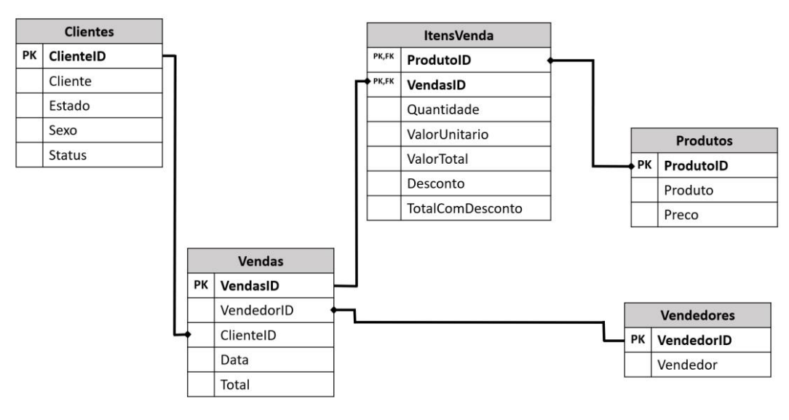

#Spark/PySpark - Atividades com Banco de Dados de Loja do Varejo (Produtos de Ciclismo)

>Resolução de problemas de negócio e soluções de atividades envolvendo banco de dados de uma loja do varejo. Atividades realizadas junto ao curso "Formação Spark com Pyspark : O Curso Completo [2022]"

## Objetivo: 

O presente projeto tem como objetivo simular requisições e problemas de negócios de uma loja do varejo fictícia e apresentar soluções utilizando o PySpark em um ambiente Linux/Ubuntu criado em máquina virtual (VirtualBox).

O esquema do BD Relacional da loja se dá de acordo com a imagem:

<!-- colocar screenshoot do seu projeto -->

## Preparação do ambiente

Para realizar as atividades propostas, utilizou-se da seguinte estrutura:
 
* Criação VM Linux/Ubuntu no Virtual Box;
* Importação dos arquivos .parquet para a máquina virtual e para o Spark ;
* Resolução das atividades utilizando dataframes;
* Exportação dos dataframes resposta em formato parquet;

## Desafios Propostos: 

###Atividade 1:

* Importar dos dados das tabelas para o pyspark (arquivos parquet);

* Criar consulta que mostre Nome, Estado e Status de cada cliente;

* Criar consulta que mostre apenas os clientes dos status "Platinum" e "Gold";

* Demonstrar o total de vendas agrupado por cada status.

## Arquivos de resolução

Os arquivos de resolução se encontram anexados e separados por atividade. Consistem em scripts python e arquivos gerados no formato .parquet

_______
## Meta

Link do curso: <https://www.udemy.com/course/spark-curso-completo/>

Bruno Augusto Pinto --- [Linkedin](https://www.linkedin.com/in/brunoaugp/) --- brunoaugp@hotmail.com

Currículo online: <https://brunoaugp.github.io/>

